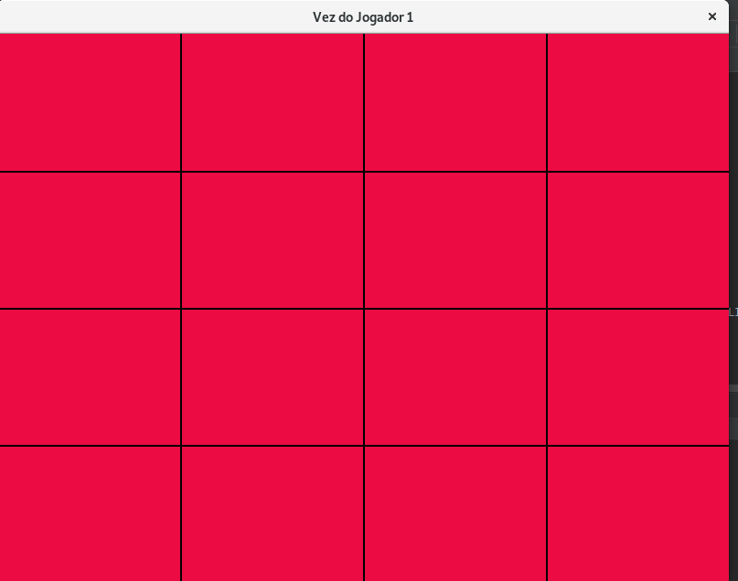
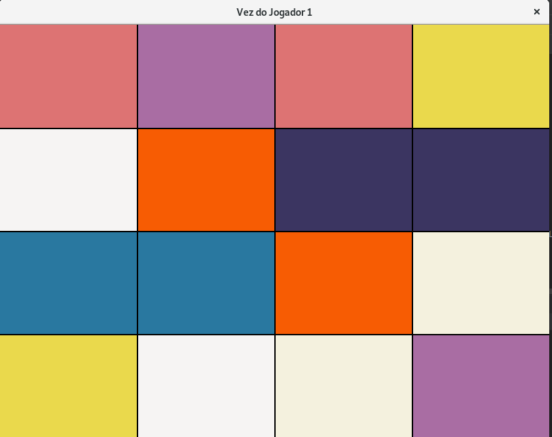

# python_tp3
 
 Projeto utilizado como resposta aos exercicios 23 e 24 do TP3 do curso de Análise e desenvolvimento de sistemas do Instituto Infnet.
 
### Descrição
 
 Simulação simples do jogo da memória, usando biblioteca pygame. Basicamente o jogador pode selecionar dois blocos de um grid de quadrados vermelhos para revelarem suas cores, e caso as cores match, o jogador pontua, do contrário ele perde ponto até o valor de zero.
 
### Ferramentas
 
 * python 3.7
 * biblioteca Pygame

 

  
 
### Detalhes
 
 Os arquivos exercicio23 e exercicio24, ambos tratam do mesmo jogo, exceto que arquivo é uma simulação para dois jogadores.
 
### Futura modificações

  Criar um executável para ambos os arquivos.